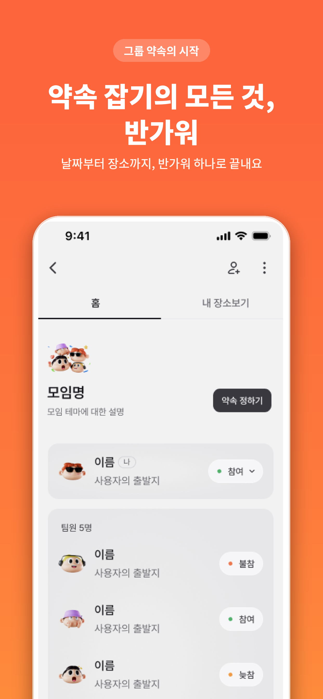
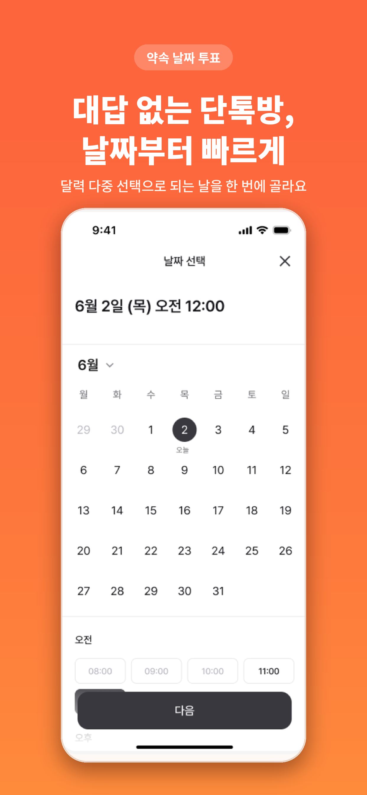
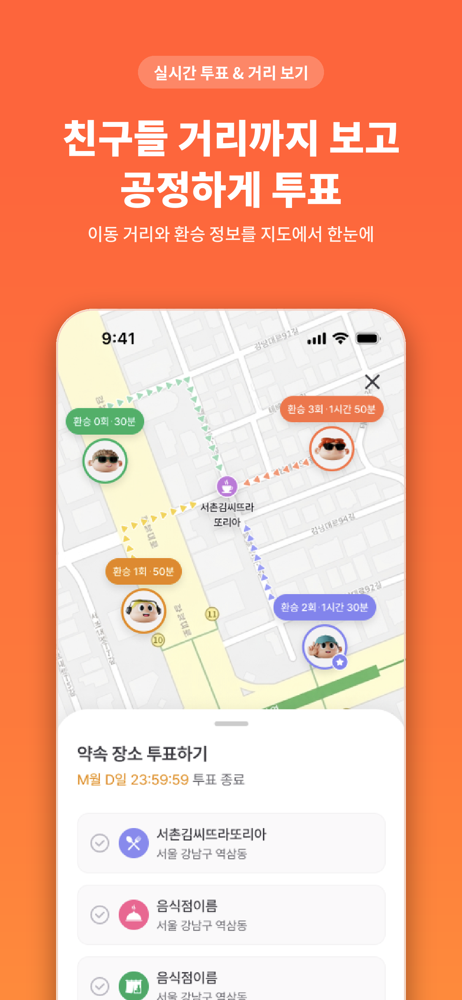

<div align="center">

# 반가워

### 날짜부터 장소까지, 그룹 약속의 시작


</div>

<br/>

<div align="center">

| | | | |
|:---:|:---:|:---:|:---:|
|  |  |  |  |
| 모임 관리 | 날짜 투표 | 장소 추천 | 이동 거리 |

</div>

<br/>

## 개요

그룹 약속의 날짜 조율과 만남 장소 선정을 한 앱에서 처리하는 iOS 앱이다.

날짜 투표(참여 · 불참 · 늦참), 멤버 출발지 기반 중간 지점 추천, 출발지별 이동 거리 비교, 지하철역 · 주변 장소 검색, 링크 초대 기반 모임 관리로 구성된다.

<br/>

## 기술 스택

| 구분 | 내용 |
| --- | --- |
| 언어 · UI | Swift 6.0 (Swift 6 언어 모드), SwiftUI |
| 아키텍처 | TCA(The Composable Architecture) 1.25 + Clean Architecture 멀티모듈 (24개 모듈) |
| 프로젝트 관리 | Tuist 4.174.0 (mise로 버전 고정), 로컬 플러그인 3종 |
| 의존성 | SPM(`Tuist/Package.swift`), 앱 타겟 외 전부 staticFramework |
| 주요 SDK | Kakao Maps 2.12 · Kakao Login/Share 2.27, Naver ID Login 5.1, Firebase 12.15(Core · Messaging), AsyncMoya 1.1.8 |
| 배포 | fastlane(match · TestFlight · App Store), GitHub Actions |
| 최소 지원 | iOS 26.0 이상, iPhone 전용 |

서드파티 패키지는 `SWIFT_STRICT_CONCURRENCY: minimal` 로 완화하지만, 자사 모듈은 예외 없이 Swift 6 언어 모드를 따른다.

<br/>

## 모듈 구조

```
Projects/
├── App/                          # 앱 타겟 — 진입점 + Composition Root(Factory)
├── Presentation/
│   ├── Presentation/             # Presentation 공통
│   ├── RootFeature/              # 루트 라우팅
│   ├── AuthFlowFeature/          # 로그인 · 약관 · 출발지 등록
│   ├── ProfileInputFeature/      # 프로필 입력
│   ├── HomeFeature/              # 모임 생성/상세, 날짜 투표, 장소 선정
│   └── StationSearchFeature/     # 역 검색 시트
├── Core/
│   └── CoreDependencies/         # TCA Dependency Client 정의
├── Domain/
│   ├── Entity/                   # 도메인 엔티티
│   ├── UseCase/                  # UseCase protocol (구현 없음)
│   ├── DomainInterface/          # 도메인 에러 · 공용 protocol
│   └── DataInterface/            # Repository protocol
├── Data/
│   ├── Model/                    # DTO + Entity 변환
│   ├── API/                      # Endpoint 정의
│   ├── Service/                  # SDK 어댑터 (Kakao · Naver 등)
│   ├── Repository/               # Repository 구현체
│   └── DataUseCase/              # UseCase 구현체
├── Network/
│   ├── Networking/               # HTTP 클라이언트
│   ├── Foundations/              # 네트워크 유틸리티
│   └── ThirdPartys/              # AsyncMoya 등 외부 래핑
└── Shared/
    ├── DesignSystem/             # 공통 UI 컴포넌트 · 디자인 토큰
    ├── DesignSystemDemo/         # 디자인 시스템 데모 앱
    ├── Shared/                   # 공통 공유 모듈
    └── Utill/                    # 날짜 · 문자열 · 로깅 유틸리티
```

### 의존성 방향

```
Presentation → CoreDependencies → Domain ← Data → Network
                       App (모든 모듈을 아는 Composition Root)
```

- `Presentation` 은 `Data` 계열(Repository · DataUseCase · Model · API · Service)을 import 하지 않는다.
- `CoreDependencies` 는 Domain UseCase protocol만 알고, 실제 구현체 조립은 `App/Sources/Factory/` 에서 한다.
- 계층 ↔ 모듈 매핑의 단일 소스는 `Plugins/DependencyPlugin/ProjectDescriptionHelpers/TargetDependency+Module/Modules.swift` 다. 새 모듈은 `./tuisttool moduleinit` 이 이 파일에 자동 등록한다.
- 상세 규칙은 [TCA Dependency 컨벤션](docs/conventions/tca-dependency-convention.md) 참고.

<br/>

## 시작하기

### 요구사항

| 도구 | 버전 | 비고 |
| --- | --- | --- |
| macOS | Sonoma 이상 | |
| Xcode | 26 이상 | iOS 26.0 SDK 필요 |
| [mise](https://mise.jdx.dev) | 최신 | Tuist 버전 관리 (`mise.toml`) |
| Ruby + Bundler | 시스템 기본 | fastlane 실행용 (`bundle install`) |

### 최초 세팅

```sh
# 1. Tuist 설치 (mise가 mise.toml의 버전을 맞춰준다)
mise install

# 2. 비공개 설정 파일 내려받기
make download-privates

# 3. 의존성 설치 + Xcode 프로젝트 생성
./tuisttool build

# 4. 워크스페이스 열기
open Bangawo.xcworkspace
```

### 비공개 설정 파일

`Config/` 아래 xcconfig는 API 키를 담고 있어 저장소에 포함되지 않는다.
`make download-privates` 를 실행하면 GitHub 액세스 토큰을 물어보고(입력 값은 `.env` 에 저장) 비공개 저장소에서 아래 파일을 내려받는다.

```
Config/
├── Debug.xcconfig      # Secrets.xcconfig include
├── Prod.xcconfig       # Secrets.xcconfig include
├── Release.xcconfig    # Secrets.xcconfig include
└── Secrets.xcconfig    # 실제 키
```

`Secrets.xcconfig` 에 필요한 키는 다음과 같다. 토큰을 받을 수 없다면 팀에 요청한다.

`KAKAO_APP_KEY` · `KAKAO_DEMO_APP_KEY` · `KAKAO_REST_API_KEY` · `NAVER_CLIENT_ID` · `NAVER_CLIENT_SECRET` · `NAVER_URL_SCHEME` · `SERVER_BASE_URL`

키를 수정했다면 `make upload-privates` 로 비공개 저장소에 반영한다.

### 디바이스 빌드

시뮬레이터는 위 절차만으로 동작한다. 실기기로 빌드할 때 프로파일 에러가 나면 인증서를 내려받아야 한다.

```sh
bundle exec fastlane match_development
```

자세한 내용은 [코드 사이닝](docs/code-signing.md) 문서를 참고한다.

<br/>

## 자주 쓰는 명령

| 명령어 | 설명 |
| --- | --- |
| `./tuisttool generate` | Xcode 프로젝트 생성 |
| `./tuisttool build` | clean → install → generate 순차 실행 |
| `./tuisttool install` | 의존성 설치 |
| `./tuisttool clean` | 프로젝트 정리 |
| `./tuisttool moduleinit` | 새 모듈 스캐폴딩 + `Modules.swift` 자동 등록 |
| `./tuisttool inspect-imports` | 암시적 의존성 검사 |
| `make generate` | `tuist install` + `tuist generate` |
| `make regenerate` | 생성물 삭제 후 재생성 |
| `make reset` | Tuist 캐시까지 초기화 |
| `make download-privates` | 비공개 xcconfig 내려받기 |
| `xcodebuild -workspace Bangawo.xcworkspace -scheme Bangawo build` | 빌드 |
| `xcodebuild -workspace Bangawo.xcworkspace -scheme Bangawo test` | 테스트 |

> **파일을 추가·삭제했거나 `Project.swift` · 의존성을 수정했다면 반드시 `./tuisttool generate` 를 실행한다.**
> Tuist가 glob으로 소스를 수집하기 때문에, 생성하지 않으면 Xcode 프로젝트에 반영되지 않는다.

디자인 시스템 컴포넌트만 확인하려면 `DesignSystemDemo` 스킴을 실행한다.

<br/>

## 개발 전략

### 브랜치 · PR

| 브랜치 | 용도 |
| --- | --- |
| `main` | 배포 |
| `develop` | 통합 |
| `feature/#{issue-number}` | 작업 |

작업 브랜치에서 `develop` 으로 PR을 올리고, 리뷰 후 머지한다. PR 제목은 `[TYPE] 설명` 형식으로 쓴다.

### 커밋

`[HEADER]: 메시지` 형식. 메시지는 한국어 50자 이하로, 무엇을 왜 바꿨는지 쓴다.

```
[FEAT]: 날짜 투표 화면 구현
[FIX]: 캐러셀 오프셋 계산 오류 수정
```

HEADER 목록과 상세 규칙은 [커밋 컨벤션](docs/commit-convention.md) 참고.

### 테스트

- TCA Reducer는 `TestStore` 로 검증하고, 의존성은 `withDependencies` 에서 필요한 클로저만 override한다.
- 테스트 소스 경로는 `Tests/Sources/**` 로 고정한다. Tuist 템플릿 규약이라 다른 경로에 두면 타겟에 포함되지 않는다.
- 모듈에 테스트 타겟이 필요하면 해당 `Project.swift` 의 `makeModule` 에 `hasTests: true` 를 준다.
- 스킴은 코드 커버리지가 켜진 상태로 생성된다(`Scheme.makeScheme`).
- **테스트는 시뮬레이터에서 실행한다.** `BangawoTests` 번들 ID에 대응하는 match 프로파일이 없어 디바이스 대상 실행은 사이닝에서 실패한다.
- 현재 테스트 프레임워크는 XCTest다.
- `develop` · `main` 대상 PR에서는 CI가 빌드와 테스트를 자동 실행한다(`pr-validate.yml`). 로컬에서 깨진 채로 PR을 올리면 머지 전에 걸린다.

### CI/CD

| 워크플로 | 트리거 | 동작 |
| --- | --- | --- |
| `gemini-code-review.yml` | `develop` 대상 PR | 자동 코드 리뷰 코멘트 |
| `pr-validate.yml` | `develop` · `main` 대상 PR | 빌드 + 테스트 (머지 전 검증) |
| `testflight-deploy.yml` | `main` PR 머지 · 수동 | TestFlight 업로드 |
| `release-tag.yml` | 수동(버전 입력) | 릴리즈 노트 생성 + `v*.*.*` 태그 |
| `appstore-release.yml` | `v*.*.*` 태그 push · 수동 | 메타데이터 업로드 + 심사 제출 |

`develop` 이 1차 방어선, `main` 이 2차 방어선이다. `main` 대상 검증은 `develop` → `main` 사이에 쌓인 여러 PR의 조합에서만 나는 문제를 잡는다.

#### 빌드 · 배포가 스킵되는 변경

`pr-validate` 와 `testflight-deploy` 는 변경 파일이 **전부** 아래에 해당하면 빌드를 건너뛴다. 판정 기준은 `.github/scripts/has-app-changes.sh` 한 곳에 있다.

```
*.md   ·   docs/**   ·   .github/ISSUE_TEMPLATE/**
.github/scripts/**   ·   .gitignore   ·   .editorconfig
```

`.mise.toml`(Tuist 버전 고정)과 `.github/workflows/**`(배포 로직 자체)는 의도적으로 제외 목록에 없다. 스킵 여부와 사유는 Actions 실행 요약에 남는다.

TestFlight 배포만 따로 건너뛰려면 PR에 `skip-testflight` 라벨을 붙인다.

App Store 메타데이터(앱 이름 · 설명 · 키워드 · 스크린샷)의 원본은 `fastlane/metadata/` 다.
App Store Connect 웹에서 수정하지 말고 이 파일들을 고쳐 커밋한다. 배포 시 덮어쓰기된다.

<br/>

## 문서

설계 근거와 컨벤션은 `docs/` 아래에 주제별로 나눠 두었다.

| 문서 | 내용 |
| --- | --- |
| [코드 컨벤션](docs/code-convention.md) | Swift · SwiftUI 코드 스타일 |
| [TCA 컨벤션](docs/tca-convention.md) | TCA Feature 작성 규칙과 근거 |
| [TCA Dependency 컨벤션](docs/conventions/tca-dependency-convention.md) | Dependency Client 설계와 Composition Root 조립 |
| [디자인 토큰 사용법](docs/design-tokens-usage.md) | 디자인 토큰 자동 생성 파이프라인과 사용법 |
| [리소스 네이밍](docs/resource-naming.md) | 이미지 · 아이콘 에셋 네이밍 |
| [커밋 컨벤션](docs/commit-convention.md) | 커밋 메시지 형식 |
| [코드 사이닝](docs/code-signing.md) | match 기반 인증서 · 프로파일 관리 |
| [App Store 배포](docs/app-store-release.md) | TestFlight → 심사 제출 파이프라인 |
| [회원가입 플로우 스펙](docs/specs/auth-signup-flow.md) | 기능 요구사항 스펙 예시 |

<br/>

## Contributors

[DDD](https://dddstudy.notion.site/) 13기 iOS 2팀.

| iOS |
| --- |
| [@khyeji98](https://github.com/khyeji98) · [@duthd3](https://github.com/duthd3) |

디자인 토큰은 별도 저장소 [design-tokens](https://github.com/zizizoi0709-p/design-tokens) 에서 Style Dictionary로 생성되며, 디자이너가 토큰을 수정하면 PR이 자동 생성되어 `DesignSystem` 모듈에 반영된다.
